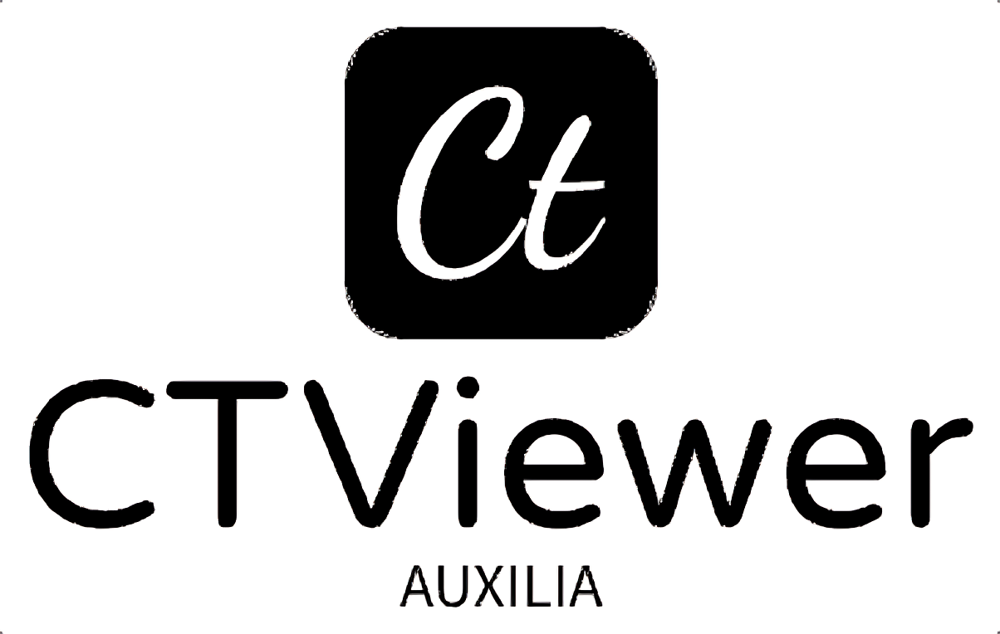

# CTViewer

[](https://opensource.org/licenses/MIT)
[](https://codecov.io/gh/Auxilia-tech/ctviewer)
[](https://github.com/Auxilia-tech/ctviewer/actions/workflows/tests.yaml)

<div align="center">
  
  <h2>3D CT File Viewer</h2>
  <p>CTViewer is a pioneering open-source application for visualizing and analyzing volumetric images from various CT data formats. We are proud to be the first open-source project to support viewing DICOS files, a format used in security X-ray machines, through our custom wrapper, <strong>PyDICOS</strong>. CTViewer also provides comprehensive support for other widely-used medical imaging formats, including DICOM, MHD, and NII.GZ. Our tool offers advanced visualization techniques such as Ray Casting and Iso Surface Browsing, catering to both medical and security domains.
</div>

## Table of Contents

- [Screenshot](#screenshot)
- [Features](#features)
- [Prerequisites](#prerequisites)
- [Installation](#installation)
- [Usage](#usage)
- [Contributing](#contributing)
- [License](#license)
- [Support](#support)
- [Acknowledgements](#acknowledgements)
- [License](#license)

## Screenshot

<div align="center">
  
</div>

## Features

- **Unique Support for DICOS Files**:
  - First open-source viewer capable of rendering DICOS files, used in security X-ray machines, via our [PyDICOS](https://github.com/Auxilia-tech/pyDICOS) library
- **Comprehensive Format Support**:
  - DICOM, MHD, NII.GZ for medical CT imaging
- **Ray Cast Plotter Mode**:
  - Max Projection
  - Composite Mode
- **Iso Surface Browser Mode**
- **Volume Slicing**:
  - Adjustable slicing planes for detailed cross-sectional analysis
- **Interactive 3D Visualization**:
  - Rotate, zoom, and pan to explore CT data in three dimensions
- **Customizable Rendering Settings**:
  - Adjust lighting, opacity, and color maps for enhanced visualization
- **Multi-Platform Support** *(Upcoming Feature)*:
  - Planned support for macOS, Linux, and Windows
- **Command-Line Arguments** *(Upcoming Feature)*:
  - Planned support for specifying visualization modes and loading specific CT data files on startup

## Prerequisites

Before installing CTViewer, ensure you have the following dependencies installed:

- `vedo>=2024.5.1`: A Python module for scientific visualization, compatible with VTK
- `vtk`: VTK (The Visualization Toolkit) modules for 3D computer graphics, image processing, and visualization
- `PyQt6`: Python bindings for the Qt application framework
- `connected-components-3d`: A package for analyzing connected components in 3D images
- `pydicos`: Our custom open-source wrapper for the DICOS file format. Install from [PyDICOS](https://github.com/Auxilia-tech/pyDICOS).

## Installation

To install CTViewer from source, follow these steps:

```bash
git clone https://github.com/Auxilia-tech/ctviewer.git
cd ctviewer
pip install -r requirements.txt
```

## Usage

To start the application, simply run the main script:

```bash
python ctviewer/main.py
```

## Contributing

We welcome contributions from the community! If you'd like to contribute to CTViewer, please follow these steps:

1. **Fork the repository** on GitHub.
2. **Clone your fork** locally:

   ```bash
   git clone https://github.com/your-username/ctviewer.git
   ```

3. **Create a new branch** for your feature or bugfix:

   ```bash
   git checkout -b feature/my-feature
   ```

4. **Make your changes** and commit them:

   ```bash
   git commit -m "Description of my feature"
   ```

5. **Push your changes** to your fork:

   ```bash
   git push origin feature/my-feature
   ```

6. **Open a Pull Request** on the main repository.

## License

This project is licensed under the MIT License - see the [LICENSE](LICENSE) file for details.

## Support

For support, please open an issue on [GitHub](https://github.com/Auxilia-tech/ctviewer/issues) or contact us at [contact@auxilia-tech.com](contact@auxilia-tech.com).

## Acknowledgements

- **vedo**: Scientific visualization library for VTK
- **VTK**: The Visualization Toolkit for 3D computer graphics
- **Qt**: Cross-platform application framework used for the graphical user interface

---

## License

This project is licensed under the MIT License - see the [LICENSE](LICENSE) file for details.

<div align="center">
  Made with ❤️ by the Auxilia team.
</div>
