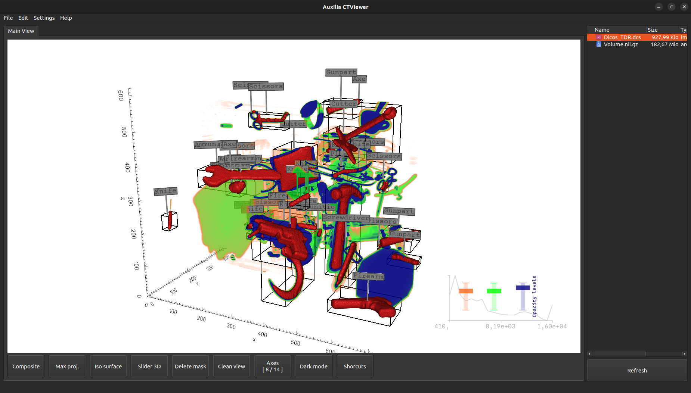

# CTViewer

3D CT file viewer is an application designed for visualizing volumetric images generated from computed tomography (CT) data. This type of viewer typically offers two main modes for 3D representation: Ray Cast Plotter mode (with Max Projection and Composite mode) and Iso Surface Browser mode.

## Capture d'écran



## Prérequis

- vedo
- vtk
- PyQt5
  
## Installation

```bash
git clone https://github.com/Auxilia-tech/ctviewer.git
cd ctviewer
pip install -r requirements.txt
python main.py

```
